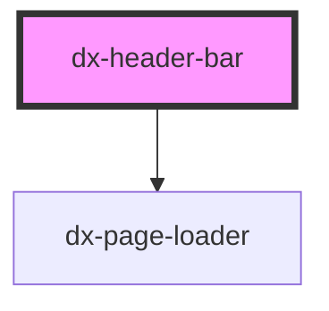

# dx-header-bar

<!-- Auto Generated Below -->

## Properties

| Property  | Attribute  | Description | Type     | Default       |
| --------- | ---------- | ----------- | -------- | ------------- |
| `menuUrl` | `menu-url` |             | `string` | `'menu.json'` |

## Dependencies

### Depends on

- [dx-page-loader](../page-loader)

### Graph

----------------------------------------------

*Built with [StencilJS](https://stenciljs.com/)*
