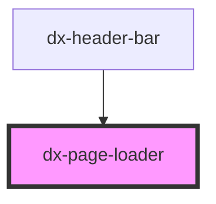

# dx-page-loader

<!-- Auto Generated Below -->

## Properties

| Property             | Attribute              | Description | Type      | Default       |
| -------------------- | ---------------------- | ----------- | --------- | ------------- |
| `defaultTemplateUrl` | `default-template-url` |             | `string`  | `'home.html'` |
| `templateUrl`        | `template-url`         |             | `string`  | `""`          |
| `useHash`            | `use-hash`             |             | `boolean` | `false`       |

## Dependencies

### Used by

 - [dx-header-bar](../header-bar)

### Graph

----------------------------------------------

*Built with [StencilJS](https://stenciljs.com/)*
