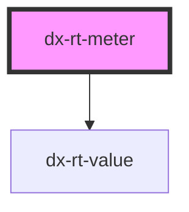

# dx-rt-meter

<!-- Auto Generated Below -->

## Properties

| Property          | Attribute          | Description | Type                                                                                   | Default       |
| ----------------- | ------------------ | ----------- | -------------------------------------------------------------------------------------- | ------------- |
| `animateColor`    | `animate-color`    |             | `string`                                                                               | `"#ffff00aa"` |
| `animateDuration` | `animate-duration` |             | `string`                                                                               | `"1s"`        |
| `bgColor`         | `bg-color`         |             | `string`                                                                               | `undefined`   |
| `color`           | `color`            |             | `string`                                                                               | `undefined`   |
| `name`            | `name`             |             | `string`                                                                               | `undefined`   |
| `size`            | `size`             |             | `"large" \| "medium" \| "small" \| "x-large" \| "x-small" \| "xx-large" \| "xx-small"` | `undefined`   |
| `topicName`       | `topic-name`       |             | `string`                                                                               | `undefined`   |
| `unit`            | `unit`             |             | `string`                                                                               | `undefined`   |

## Dependencies

### Depends on

- [dx-rt-value](../rt-value)

### Graph

----------------------------------------------

*Built with [StencilJS](https://stenciljs.com/)*
