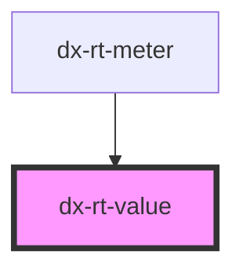

# dx-rt-value

<!-- Auto Generated Below -->

## Properties

| Property          | Attribute          | Description | Type      | Default         |
| ----------------- | ------------------ | ----------- | --------- | --------------- |
| `animateColor`    | `animate-color`    |             | `string`  | `"#ffff0083"`   |
| `animateDuration` | `animate-duration` |             | `string`  | `"1s"`          |
| `bgColor`         | `bg-color`         |             | `string`  | `"transparent"` |
| `color`           | `color`            |             | `string`  | `"inset"`       |
| `inline`          | `inline`           |             | `boolean` | `true`          |
| `topicName`       | `topic-name`       |             | `string`  | `undefined`     |

## Dependencies

### Used by

 - [dx-rt-meter](../rt-meter)

### Graph

----------------------------------------------

*Built with [StencilJS](https://stenciljs.com/)*
